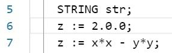
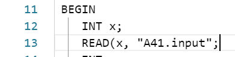
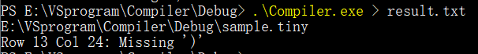

# 词法分析、语法分析程序实验

[toc]

> ## **2019.11.12**
>
> 此为C++版本
>
> ==**c++程序请用g++ c++11标准编译**==
>
> （推荐到Github查看，因为Github对markdown中代码换行处理较好）
>
> [Github地址]( https://github.com/wywwwwei/CompilersPrinciple/tree/master/mid-termHW )
>
> ## 2019.11.30 Update
>
> ==C语言版本==
>
> 对比C++实现有以下改进：
>
> - 边语法分析边词法分析，避免使用过大的空间来存储token
>
> 其他方面基本一致

## 实验目的

扩充已有的样例语言TINY，为扩展TINY语言TINY+构造词法分析和语法分析程序，从而掌握词法分析和语法分析的构造方法。

## 实验内容

了解样例语言TINY及TINY编译器的实现，了解扩展TINY语言TINY+，用EBNF描述TINY+的语法，用C语言扩展TINY的词法分析和语法分析程序，构造TINY+的递归下降语法分析器。

## 实验要求

将TINY+源程序翻译成对应的TOKEN序列，并能检查一定的词法错误。将TOKEN序列转换成语法分析树，并能检查一定的语法错误

## 我所实现的扩展内容

由于我所做的扩展不多，==EBNF基本与原来的TINY相同==，WhileStmt和IfStmt基本一致，BoolExpression多了四组

- `STRING`作为新的关键词，同时能创建STRING类型变量
- `WHILE`作为新的关键词，表示循环结构
- 扩展Operator，比如`<`、 `>`、 `<=`、`>=`

```
Program -> MethodDecl MethodDecl* 
MethodDecl -> Type [MAIN] Id '(' FormalParams ')' Block
FormalParams -> [FormalParam ( ',' FormalParam )* ]
FormalParam -> Type Id
Type -> INT | REAL | STRING

Block -> BEGIN Statement* END

Statement -> Block
           | LocalVarDecl  
           | AssignStmt   
           | ReturnStmt
           | IfStmt
           | WhileStmt
	   | WriteStmt
	   | ReadStmt        
LocalVarDecl -> INT Id ';' | REAL Id ';' 
AssignStmt  -> Id := Expression ';'
ReturnStmt -> RETURN Expression ';'
IfStmt    -> IF '(' BoolExpression ')' Statement
            | IF '(' BoolExpression ')' Statement ELSE Statement
WriteStmt -> WRITE '(' Expression ',' QString ')' ';'
ReadStmt  -> READ '(' Id ',' QString ')' ';'
QString is any sequence of characters except double quote itself, enclosed in double quotes.

Expression -> MultiplicativeExpr  (( '+' | '-' ) MultiplicativeExpr)*
MultiplicativeExpr -> PrimaryExpr (( '*' | '/' ) PrimaryExpr)*
PrimaryExpr -> Num  // Integer or Real numbers
             | Id            
             | '(' Expression ')'
             | Id '(' ActualParams ')'
BoolExpression -> Expression '==' Expression 
                 |Expression '<' Expression
                 |Expression '>' Expression
                 |Expression '<=' Expression
                 |Expression '>=' Expression
ActualParams -> [Expression ( ',' Expression)*]

```

## 实验步骤

### 词法分析器

#### （扫描阶段）双输入缓冲区

在实践中，我们的却需要至少想前看一个字符。因此，我们使用一种双缓冲区方案，能够安全地处理向前看多个符号的问题，并使用“哨兵标记”来节约用于检查缓冲区末端的时间

可用于

- 获取当前所在行数、列数
- 获取当前指针所指字符，（并使指针指向下一个字符）
- 获取当前词素lexeme

```c++
#pragma once
#include<fstream>
#include<string>

#define BUF_SIZE 1024

class Scan
{
public:
	explicit Scan(std::string filePath);
	~Scan() noexcept;
	
	std::string getString();
	void readFromFile();
	char nextChar();
	char curChar();
	int getRow();
	int getCol();
	void nextLexeme();
private:
	std::ifstream fileStream;

	char* lexemeBegin;
	char* forward;

	char readBuffer1[BUF_SIZE];
	char readBuffer2[BUF_SIZE];

	enum Tag {FirstBuf,SecondBuf};
	Tag currentBuf = Tag::FirstBuf;

	int row = 1;
	int col = 1;
};
```

带有哨兵标记的forward指针移动算法

```c++
void Scan::readFromFile() {
	if (currentBuf == Tag::FirstBuf) {
		readBuffer2[BUF_SIZE - 1] = EOF;
		fileStream.read(readBuffer2, BUF_SIZE - 1);

		currentBuf = Tag::SecondBuf;
		forward = &readBuffer2[0];
	}
	else {
		readBuffer1[BUF_SIZE - 1] = EOF;
		fileStream.read(readBuffer1, BUF_SIZE - 1);

		currentBuf = Tag::FirstBuf;
		forward = &readBuffer1[0];
	}
}

char Scan::nextChar() {
	switch (*forward)
	{
	case EOF:
		readFromFile();
		break;
	case '\n':  //剔除回车
		col = 1;
		row++;
		forward++;
		return nextChar();
	default:
		col++;
		break;
	}
	return *forward++;
}
```

#### (分析阶段)分析器

##### Token

1.枚举类型，对应Token-name

```c++
typedef enum  {
	//keywords
	IF,
	ELSE,
	WHILE,
	WRITE,
	READ,
	RETURN,
	BEGIN,
	END,
	MAIN,
	INT,
	REAL,
	STRING,

	IDENTIFIER,
	//Operator such as + - * / == := !=
	Operator,
	//Delimeter such as ; , ( )
	Delimeter,
	Number,
	String
}tokenType;
```

2.保存所有词法单元的结构体，包含<token-name,attribute-value>对以及所在的位置

```c++
typedef struct node{
	tokenType type;
	std::string content;
	int row;
	int col;
	int indent;

	node(tokenType _type, std::string str,int _row,int _column) {
		type = _type;
		content = str;
		row = _row;
		col = _column;
	}
}tokennode;
```

3. Token类，用于输出和匹配字符串和关键词

```c++
#define KEYWORD_SIZE 12
#define DELIM_SIZE 4
#define OPT_SIZE 11

class Token {
public:
	std::string keyword[KEYWORD_SIZE] = { "IF","ELSE","WHILE","WRITE", "READ", "RETURN", "BEGIN", "END", "MAIN", "INT", "REAL","STRING"};
	std::string operation[OPT_SIZE] = { "+","-","*","/","==",":=","!=","<",">","<=",">=" };
	std::string delimeter[DELIM_SIZE] = { ";",",","(",")" };
	tokenType getToken(std::string lexeme);
	std::string getTokenStr(tokenType token);
private:
};
```

##### 字符处理

定义了以下的处理类

```c++
class lexicalAnalyzer {
public:
	explicit lexicalAnalyzer(std::string filePath);
	~lexicalAnalyzer();
	void analyse();						//分析，字符处理
	void logError(std::string errMsg);	//错误处理
	void printToken(tokenType _token);	//打印
	tokennode* getTokenAt(int index);	//供语法分析器调用
	int getTokenSize();					//供语法分析器使用
private:
	Token token;						//用于匹配token			
	Scan input;							//从输入缓冲区获取字符
	std::vector<tokennode*> tokensStore;//保存词法单元
};
```

字符处理方法：

1. 检查是否'\_'/'a-z'/'A-Z'，如果是则一直读取直到其不为'\_'/'a-z'/'A-Z'/'0-9'，并将该字符串用作匹配，看是Identifier还是Keyword
2. 忽略空格和换行符
3. 比较查看是否是操作符（有可能需要向后多读一位），如果是'/'符号，则需要预读两位看是否是注释
4. 比较查看是否是分隔符，将其token-name设为DELIMITER
5. 当读到双引号时，继续读直到读到另一个双引号，并将其token-name设为STRING
6. 当是数字时，判断是小数还是整数，将其token-name设为NUMBER

错误检测：

当读到的字符不在意料之中（比如冒号后面没有等于号 或者 开头字符不在我们的switch..case..之中的），则报错，并显示其错误位置




部分代码，表示分析器的大致结构

```c++
switch (current)
{
case' ':
case'\t':
    break;
case'=':
    if (input.nextChar() == '=') {
        printToken(Operator);
        break;
    }
    logError("Row" + std::to_string(input.getRow()) + "  Column" + std::to_string(input.getCol()) + ": Unrecognizable characters.");
case':':
    if (input.nextChar() == '=') {
        printToken(Operator);
        break;
    }
    logError("Row" + std::to_string(input.getRow()) + "  Column" + std::to_string(input.getCol()) + ": Unrecognizable characters.");
case '!':
    if (input.nextChar() == '=') {
        printToken(Operator);
        break;
    }
    logError("Row" + std::to_string(input.getRow()) + "  Column" + std::to_string(input.getCol()) + ": Unrecognizable characters.");
case ';':
case',':
case '(':
case ')':
    printToken(Delimeter);
    break;
case '+':
case '-':
case '*':
    printToken(Operator);
    break;
	...
}
```

### 语法分析器

##### 递归下降分析程序

> 一个递归下降语法分析程序有一组过程组成，每个非终结符号有一个对应的过程。程序的执行从开始符号对应的过程开始，如果这个过程的过程体扫描了整个输入串，它就停止执行并宣布语法分析成功完成。

通用的递归下降分析技术可能需要回溯，也就是说，他可能重复扫描输入，

这里通过将词法单元保存到vector中的方法来简化获取操作，缺点就是过于占用内存

首先，每一个非终结符号对应一个过程

```c++
class SyntaxAnalyzer {
public:
	explicit SyntaxAnalyzer(std::string filePath);
	void analyse();
	void logError(std::string errMsg);
	bool compareContent(tokennode* tempnode, std::string cmp);
	bool compareType(tokennode* tempnode, tokenType cmp);
	void printTree();
	//High-level program structure
	void program();
	void methodDecl();
	void type();
	void identifier();
	void formalParams();
	void formalParam();
	//statements
	void block();
	void statement();
	void localVarDecl();
	void assignStmt();
	void returnStmt();
	void ifStmt();
	void whileStmt();
	void writeStmt();
	void readStmt();
	//expression
	void expression();
	void multiplicativeExpr();
	void primaryExpr();
	void boolExpression();
	void actualParams();
private:
	lexicalAnalyzer input;
	int curIndex;
	int curDepth;
};
```

根据EBNF

```
Program -> MethodDecl MethodDecl*
```

那么我们program过程就为

当我们进入program的过程时，如果能获取到词法单元，就执行methodDecl()过程

只有当我们检测不到词法单元的时候，我们才结束program这个过程

```c++
void SyntaxAnalyzer::program()
{
	while (input.getTokenAt(curIndex) != nullptr) {
		methodDecl();
	}
}
```

而

```
MethodDecl -> Type [MAIN] Id '(' FormalParams ')' Block
```

于是

根据上述原则，因为只有一个展开式，所以只需要一个一个地匹配

```c++
void SyntaxAnalyzer::methodDecl()
{
	curDepth += 1;
	type();
	if (compareType(input.getTokenAt(curIndex) , MAIN)) {
		input.getTokenAt(curIndex)->indent = curDepth;
		curIndex++;
	}
	identifier();

	if (compareContent( input.getTokenAt(curIndex++), "(")) {
		input.getTokenAt(curIndex - 1)->indent = curDepth;
		formalParams();
	}
	else {
		logError("Missing '('");
	}
	if (!compareContent(input.getTokenAt(curIndex++), ")")) {
		logError("Missing ')'");
	}
	input.getTokenAt(curIndex - 1)->indent = curDepth;
	block();
	curDepth -= 1;
}
```

而在statement中，我们有多个展开式，

```
Statement -> Block
           | LocalVarDecl  
           | AssignStmt   
           | ReturnStmt
           | IfStmt
	   | WriteStmt
	   | ReadStmt

```

那么我们就需要往前读找到能匹配的展开式，再回溯（我这里用了vector，不需要回溯）

```c++
void SyntaxAnalyzer::statement() {
	switch (input.getTokenAt(curIndex)->type)
	{
	case INT:
	case REAL:
	case STRING:
		localVarDecl();
		break;
	case IDENTIFIER:
		assignStmt();
		break;
	case RETURN:
		returnStmt();
		break;
	case IF:
		ifStmt();
		break;
	case WHILE:
		whileStmt();
		break;
	case READ:
		readStmt();
		break;
	case WRITE:
		writeStmt();
		break;
	case BEGIN:
		block();
		break;
	default:
		curIndex++;
		logError("Unrecognizable statement, starting with the wrong");
		break;
	}
}
```

这就是一个递归下降语法分析的例子，关于本次实验的更多代码请参考附件

##### 错误分析

依然是显示出出错的位置和具体的出错信息

出错信息穿插在不同的过程之中，如有匹配不到的情况，则输出对应错误信息

比如

```c++
void SyntaxAnalyzer::ifStmt() {
	if (!compareType(input.getTokenAt(curIndex++), IF))
	{
		logError("Missing \"IF\"");
	}
	input.getTokenAt(curIndex - 1)->indent = curDepth;
	if (!compareContent(input.getTokenAt(curIndex++), "(")) {
		logError("Missing '('");
	}
	input.getTokenAt(curIndex - 1)->indent = curDepth;
	boolExpression();
	if (!compareContent(input.getTokenAt(curIndex++), ")")) {
		logError("Missing ')'");
	}
	input.getTokenAt(curIndex - 1)->indent = curDepth;
	statement();
	if (compareType(input.getTokenAt(curIndex), ELSE))
	{
		input.getTokenAt(curIndex)->indent = curDepth;
		curIndex++;
		statement();
	}
}
```

如果匹配不到括号的话，就会输出对应的错误消息。





## 实验结果

#### 运行方法

打开exe文件后，将tiny文件拖动到命令行窗口/输入绝对路径

#### 测试样例

```tiny
/** this is a comment line in the sample program **/
 INT f2(INT x, INT y ) 
 BEGIN 
    INT z;
    STRING str;
    z := 2.0;
    z := x*x - y*y;
    RETURN z; 
 END 
 INT MAIN f1() 
 BEGIN
    INT x;
    READ(x, "A41.input");
    INT y;
    READ(y, "A42.input");
    INT z;
    z := f2(x,y) + f2(y,x);
    IF(x >= y)
    BEGIN
      z := x + y;
    END
    WHILE( x >= y)
    BEGIN
      z := x + y;
    END
    WRITE (z, "A4.output"); 
 END

```

#### 测试结果

```
<Keyword   ,  INT        >
<IDENTIFIER,  f2         >
<Delimeter ,  (          >
<Keyword   ,  INT        >
<IDENTIFIER,  x          >
<Delimeter ,  ,          >
<Keyword   ,  INT        >
<IDENTIFIER,  y          >
<Delimeter ,  )          >
<Keyword   ,  BEGIN      >
<Keyword   ,  INT        >
<IDENTIFIER,  z          >
<Delimeter ,  ;          >
<Keyword   ,  STRING     >
<IDENTIFIER,  str        >
<Delimeter ,  ;          >
<IDENTIFIER,  z          >
<Operator  ,  :=         >
<Number    ,  2.0        >
<Delimeter ,  ;          >
<IDENTIFIER,  z          >
<Operator  ,  :=         >
<IDENTIFIER,  x          >
<Operator  ,  *          >
<IDENTIFIER,  x          >
<Operator  ,  -          >
<IDENTIFIER,  y          >
<Operator  ,  *          >
<IDENTIFIER,  y          >
<Delimeter ,  ;          >
<Keyword   ,  RETURN     >
<IDENTIFIER,  z          >
<Delimeter ,  ;          >
<Keyword   ,  END        >
<Keyword   ,  INT        >
<Keyword   ,  MAIN       >
<IDENTIFIER,  f1         >
<Delimeter ,  (          >
<Delimeter ,  )          >
<Keyword   ,  BEGIN      >
<Keyword   ,  INT        >
<IDENTIFIER,  x          >
<Delimeter ,  ;          >
<Keyword   ,  READ       >
<Delimeter ,  (          >
<IDENTIFIER,  x          >
<Delimeter ,  ,          >
<String    ,  "A41.input">
<Delimeter ,  )          >
<Delimeter ,  ;          >
<Keyword   ,  INT        >
<IDENTIFIER,  y          >
<Delimeter ,  ;          >
<Keyword   ,  READ       >
<Delimeter ,  (          >
<IDENTIFIER,  y          >
<Delimeter ,  ,          >
<String    ,  "A42.input">
<Delimeter ,  )          >
<Delimeter ,  ;          >
<Keyword   ,  INT        >
<IDENTIFIER,  z          >
<Delimeter ,  ;          >
<IDENTIFIER,  z          >
<Operator  ,  :=         >
<IDENTIFIER,  f2         >
<Delimeter ,  (          >
<IDENTIFIER,  x          >
<Delimeter ,  ,          >
<IDENTIFIER,  y          >
<Delimeter ,  )          >
<Operator  ,  +          >
<IDENTIFIER,  f2         >
<Delimeter ,  (          >
<IDENTIFIER,  y          >
<Delimeter ,  ,          >
<IDENTIFIER,  x          >
<Delimeter ,  )          >
<Delimeter ,  ;          >
<Keyword   ,  IF         >
<Delimeter ,  (          >
<IDENTIFIER,  x          >
<Operator  ,  >=         >
<IDENTIFIER,  y          >
<Delimeter ,  )          >
<Keyword   ,  BEGIN      >
<IDENTIFIER,  z          >
<Operator  ,  :=         >
<IDENTIFIER,  x          >
<Operator  ,  +          >
<IDENTIFIER,  y          >
<Delimeter ,  ;          >
<Keyword   ,  END        >
<Keyword   ,  WHILE      >
<Delimeter ,  (          >
<IDENTIFIER,  x          >
<Operator  ,  >=         >
<IDENTIFIER,  y          >
<Delimeter ,  )          >
<Keyword   ,  BEGIN      >
<IDENTIFIER,  z          >
<Operator  ,  :=         >
<IDENTIFIER,  x          >
<Operator  ,  +          >
<IDENTIFIER,  y          >
<Delimeter ,  ;          >
<Keyword   ,  END        >
<Keyword   ,  WRITE      >
<Delimeter ,  (          >
<IDENTIFIER,  z          >
<Delimeter ,  ,          >
<String    ,  "A4.output">
<Delimeter ,  )          >
<Delimeter ,  ;          >
<Keyword   ,  END        >
Program
        MethodDecl
                Type
                        INT
                Identifier
                        f2
                (
                FormalParams
                        FormalParam
                                Type
                                        INT
                                Identifier
                                        x
                        FormalParam
                                Type
                                        INT
                                Identifier
                                        y
                )
                Block
                BEGIN
                        Statement
                                LocalVarDecl
                                        Type
                                                INT
                                        Identifier
                                                z
                        Statement
                                LocalVarDecl
                                        Type
                                                STRING
                                        Identifier
                                                str
                        Statement
                                assignStmt
                                        Identifier
                                                z
                                        :=
                                        Expression
                                                MultiplicativeExpr
                                                        PrimaryExpr
                                                                2.0
                        Statement
                                assignStmt
                                        Identifier
                                                z
                                        :=
                                        Expression
                                                MultiplicativeExpr
                                                        PrimaryExpr
                                                                Identifier
                                                                        x
                                                        *
                                                        PrimaryExpr
                                                                Identifier
                                                                        x
                                                -
                                                MultiplicativeExpr
                                                        PrimaryExpr
                                                                Identifier
                                                                        y
                                                        *
                                                        PrimaryExpr
                                                                Identifier
                                                                        y
                        Statement
                                ReturnStmt
                                        RETURN
                                        Expression
                                                MultiplicativeExpr
                                                        PrimaryExpr
                                                                Identifier
                                                                        z
                END
        MethodDecl
                Type
                        INT
                MAIN
                Identifier
                        f1
                (
                FormalParams
                )
                Block
                BEGIN
                        Statement
                                LocalVarDecl
                                        Type
                                                INT
                                        Identifier
                                                x
                        Statement
                                ReadStmt
                                        READ
                                        (
                                        Identifier
                                                x
                                        "A41.input"
                                        )
                        Statement
                                LocalVarDecl
                                        Type
                                                INT
                                        Identifier
                                                y
                        Statement
                                ReadStmt
                                        READ
                                        (
                                        Identifier
                                                y
                                        "A42.input"
                                        )
                        Statement
                                LocalVarDecl
                                        Type
                                                INT
                                        Identifier
                                                z
                        Statement
                                assignStmt
                                        Identifier
                                                z
                                        :=
                                        Expression
                                                MultiplicativeExpr
                                                        PrimaryExpr
                                                                Identifier
                                                                        f2
                                                                (
                                                                ActualParams
                                                                        Expression
                                                                                MultiplicativeExpr
                                                                                        PrimaryExpr
                                                                                                Identifier
                                                                                                        x
                                                                        Expression
                                                                                MultiplicativeExpr
                                                                                        PrimaryExpr
                                                                                                Identifier
                                                                                                        y
                                                                )
                                                +
                                                MultiplicativeExpr
                                                        PrimaryExpr
                                                                Identifier
                                                                        f2
                                                                (
                                                                ActualParams
                                                                        Expression
                                                                                MultiplicativeExpr
                                                                                        PrimaryExpr
                                                                                                Identifier
                                                                                                        y
                                                                        Expression
                                                                                MultiplicativeExpr
                                                                                        PrimaryExpr
                                                                                                Identifier
                                                                                                        x
                                                                )
                        Statement
                                IfStmt
                                        IF
                                        (
                                        BoolExpression
                                                Expression
                                                        MultiplicativeExpr
                                                                PrimaryExpr
                                                                        Identifier
                                                                                x
                                                >=
                                                Expression
                                                        MultiplicativeExpr
                                                                PrimaryExpr
                                                                        Identifier
                                                                                y
                                        )
                                        Statement
                                                Block
                                                BEGIN
                                                        Statement
                                                                assignStmt
                                                                        Identifier
                                                                                z
                                                                        :=
                                                                        Expression
                                                                                MultiplicativeExpr
                                                                                        PrimaryExpr
                                                                                                Identifier
                                                                                                        x
                                                                                +
                                                                                MultiplicativeExpr
                                                                                        PrimaryExpr
                                                                                                Identifier
                                                                                                        y
                                                END
                        Statement
                                WhileStmt
                                        WHILE
                                        (
                                        BoolExpression
                                                Expression
                                                        MultiplicativeExpr
                                                                PrimaryExpr
                                                                        Identifier
                                                                                x
                                                >=
                                                Expression
                                                        MultiplicativeExpr
                                                                PrimaryExpr
                                                                        Identifier
                                                                                y
                                        )
                                        Statement
                                                Block
                                                BEGIN
                                                        Statement
                                                                assignStmt
                                                                        Identifier
                                                                                z
                                                                        :=
                                                                        Expression
                                                                                MultiplicativeExpr
                                                                                        PrimaryExpr
                                                                                                Identifier
                                                                                                        x
                                                                                +
                                                                                MultiplicativeExpr
                                                                                        PrimaryExpr
                                                                                                Identifier
                                                                                                        y
                                                END
                        Statement
                                WriteStmt
                                        WRITE
                                        (
                                        Expression
                                                MultiplicativeExpr
                                                        PrimaryExpr
                                                                Identifier
                                                                        z
                                        "A4.output"
                                        )
                END

```

